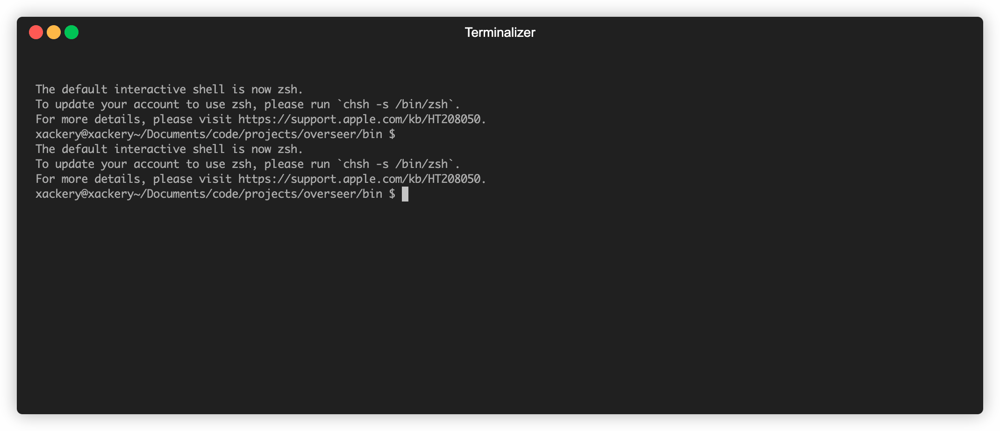

# overseer
EQEmu Management Suite

Contains the following programs:
- [bootstrap](#bootstrap): Recommended way to start the server, runs shared memory then overseer
- [overseer](#overseer): Runs zones, world, and other programs, keeping them runnning on crash, and oversees their health
- [verify](#verify): Verifies if overseer is running properly, and other run time checks
- [diagnose](#diagnose): Diagnoses issues with the server, and provides a report to suggest fixes
- [install](#install): Installs the server, and all required dependencies
- [update](#update): Updates the server, and all required dependencies

## Overseer

Run bootstrap, it'll start overseer after

## Install

## Diagnose

## Update

## Bootstrap

## Verify

